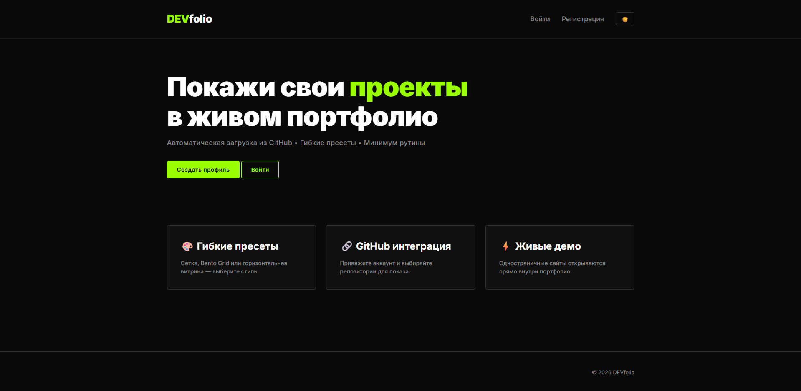
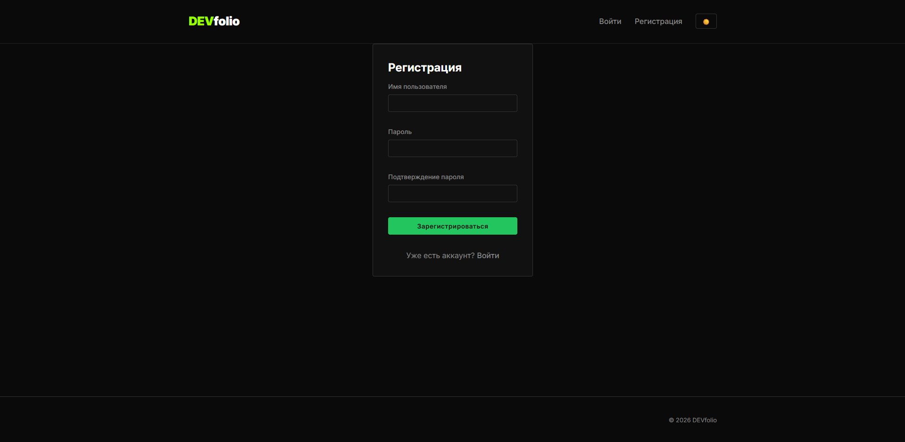
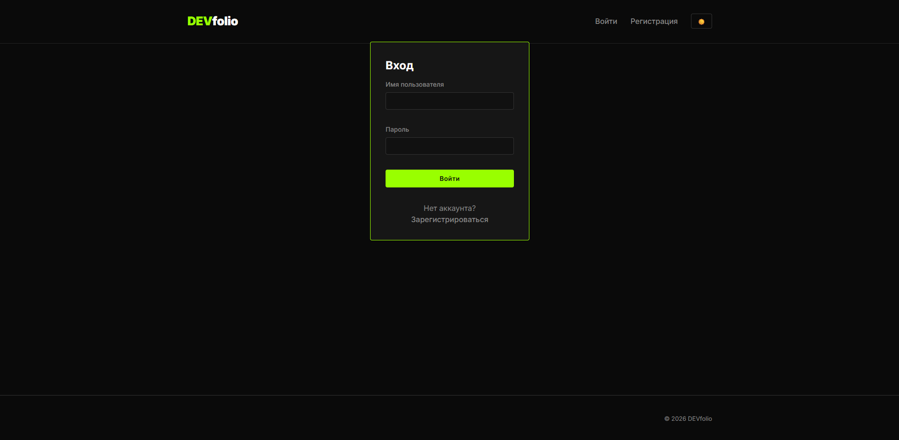
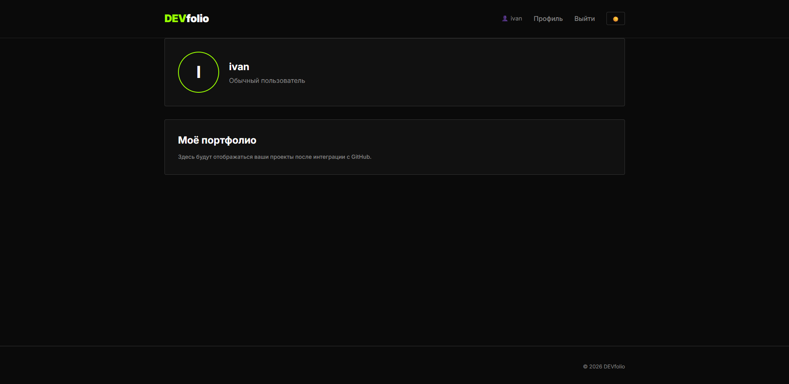
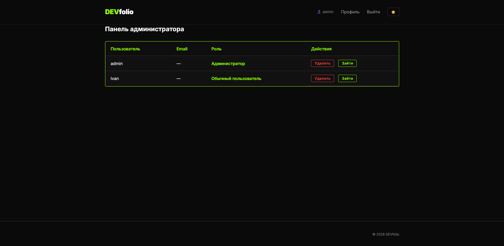
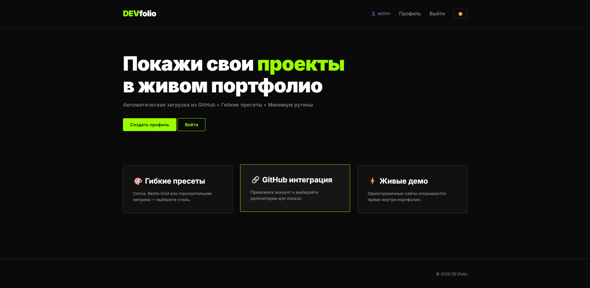
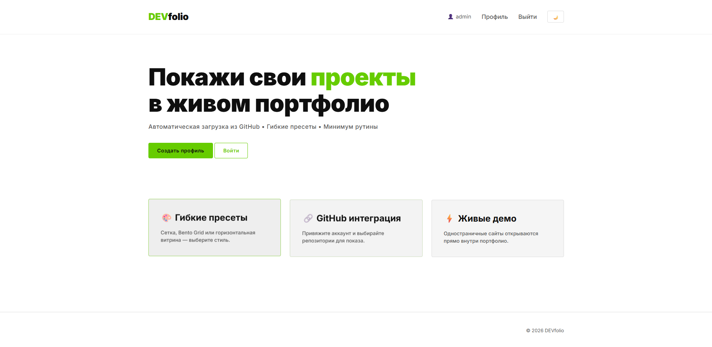

# DEVfolio 

Платформа для создания портфолио разработчиков с автоматической подгрузкой проектов из GitHub.

## 🚀 Функциональность (MVP, в разработке)

- Регистрация и вход по логину/паролю
- Две роли: обычный пользователь и администратор
- Переключатель тёмной/светлой темы (сохраняется в браузере)
- Режим impersonation (техподдержка) для администратора
- Главная страница с поиском пользователей по ID или имени
- Профиль пользователя с гибкой настройкой портфолио:
  - Три пресета отображения: сетка, Bento Grid, витрина
  - Привязка репозиториев GitHub (OAuth)
  - Автоматическая подгрузка README.md и ссылок на демо (GitHub Pages)
- Администратор может заходить в аккаунты пользователей (impersonation)
## 📸 Скриншоты

### Главная страница


### Регистрация


### Вход


### Профиль пользователя


### Панель администратора


### Тёмная и светлая тема
| Тёмная тема | Светлая тема |
|-------------|--------------|
|  |  |

## 🧱 Стек технологий

| Компонент        | Технология                                |
|------------------|-------------------------------------------|
| Бэкенд           | Python 3.11, Django 6.0.5                 |
| Фронтенд         | Чистый CSS (кастомные свойства, темы), Vanilla JS |
| База данных      | SQLite                                    |
| Аутентификация   | Django Auth, GitHub OAuth (django-allauth)|
| Контроль версий  | Git, GitHub                               |

## 📦 Установка и запуск

### 1. Клонировать репозиторий

```bash
git clone https://github.com/VANUSKA228/portfolio_project.git
cd portfolio_project
```

### 2. Создать и активировать виртуальное окружение

```bash
python -m venv venv

# Windows:
venv\Scripts\activate

# macOS/Linux:
source venv/bin/activate
```

### 3. Установить зависимости

```bash
pip install -r requirements.txt
```

### 4. Выполнить миграции

```bash
python manage.py migrate
```

### 5. Создать суперпользователя (автоматически, если его нет):

```bash
python manage.py initadmin
```
По умолчанию создаётся:

Пользователь 
```bash 
admin
```
Пароль 
```bash
123
```

### 6. Запустить сервер разработки

```bash
python manage.py runserver
```

### 7. Открыть в браузере

```text
http://127.0.0.1:8000/
```

## 📁 Структура проекта

```text
portfolio_project/
├── config/ # Настройки Django
│ ├── init.py
│ ├── settings.py # Конфигурация проекта (БД, приложения, статика)
│ ├── urls.py # Главные маршруты
│ └── wsgi.py
├── accounts/ # Приложение для работы с пользователями
│ ├── management/
│ │ └── commands/
│ │ └── initadmin.py # Команда автосоздания суперпользователя
│ ├── models.py # Модель User с дополнительным полем role
│ ├── views.py # Регистрация и кастомный выход
│ ├── urls.py # Маршруты регистрации, входа, выхода
│ ├── forms.py # Форма регистрации
│ └── admin.py # Настройка отображения модели в админке
├── core/ # Основное приложение (главная, профиль)
│ ├── views.py # Главная страница и обработка профилей по ролям
│ └── urls.py # Маршрут профиля
├── static/
│ └── css/
│ └── style.css # Кастомные стили (тёмная/светлая тема, кнопки, карточки)
├── templates/ # HTML-шаблоны
│ ├── base.html # Базовый шаблон: навигация, переключатель тем, футер
│ ├── home.html # Главная страница с преимуществами
│ ├── registration/
│ │ ├── login.html # Форма входа
│ │ └── register.html # Форма регистрации
│ ├── user_profile.html # Профиль обычного пользователя
│ └── admin_profile.html # Панель администратора (список пользователей)
├── .gitignore
├── manage.py
├── requirements.txt
└── README.md
```

## 📋 Статус проекта

Находится на этапе MVP. Реализован каркас:

- Регистрация
- Роли пользователей
- Главная страница
- Профили пользователей

## 🔮 Планируется

- Личная информация пользователя (фото, описание)
- Интеграция с GitHub OAuth
- Пресеты портфолио
- Поиск пользователей
- Панель администратора
